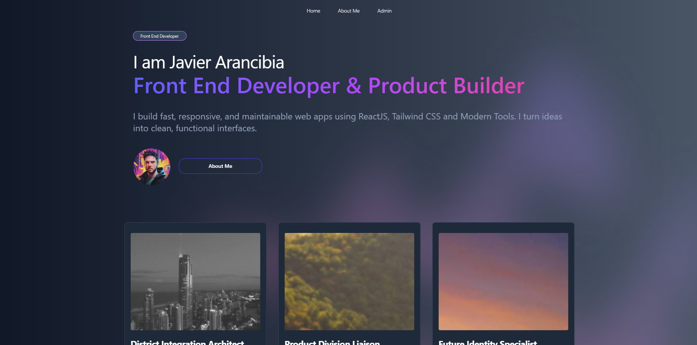

# Portfolio App – Code Challenge

This is a portfolio web application built with **Next.js 15**, designed to showcase projects and include an **admin panel** for content management.

Built using the **App Router**, **Tailwind CSS**, and **TypeScript**, it demonstrates real-world use of authentication, API integration, and rendering strategies (SSR & SSG).

---



🚀 Deployment
The app is already deployed on Vercel:

[Go to app 🔗](https://framna.vercel.app/)

## 🔧 Tech Stack

- **Next.js 15** (App Router)
- **React 18**
- **TypeScript**
- **Tailwind CSS**
- **NextAuth.js** (credentials provider)
- **MockAPI** (external API service)

---

## 🚀 Features

- Portfolio page to showcase projects
- About me section
- Admin login with authentication (NextAuth)
- Admin dashboard to create and delete projects
- SSR and SSG used for optimized rendering

---

## 🧠 Rendering Strategy

| Page                     | Strategy     | Description |
|--------------------------|--------------|-------------|
| `/` (Home)               | **SSG**      | Uses static generation (`revalidate`) with `revalidate: 60` for fast performance and up-to-date data. |
| `/admin`                | **SSR**      | Protected route that checks authentication on the server side using `auth()` |
| `/admin/projects/new`   | **Client-side** | Form handled entirely on the client for simplicity |
| `/about`                | **Static**   | Rendered at build time, as content rarely changes |

---

## 🛠️ Getting Started

### 1. Clone the repo nad install dependencies 

```bash
git clone https://github.com/your-username/portfolio-challenge.git
cd portfolio-challenge
npm install

### 2. Add Environment Variables 

```bash
ADMIN_USER=xxxx
ADMIN_PASS=xxxx
NEXTAUTH_SECRET=your_secret_key
NEXT_PUBLIC_MOCKAPI_URL=mockapi_url


### 3. Run locally 

```bash
npm run dev

### 4. Run tests 

```bash
npm run test
